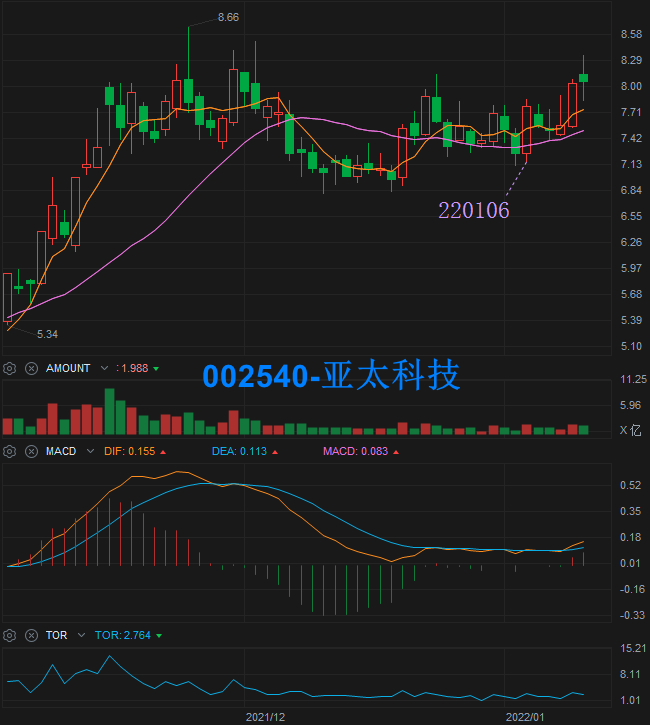
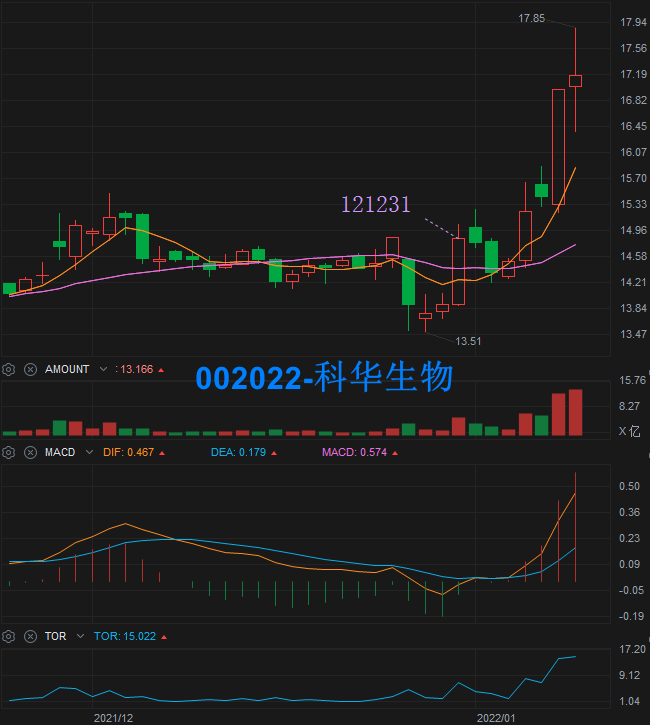
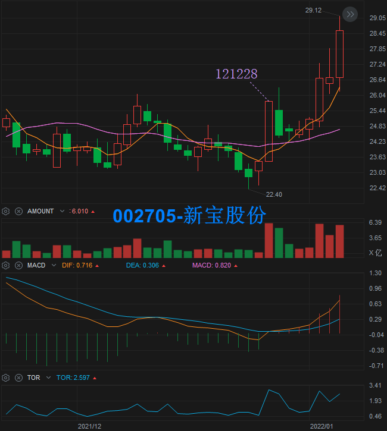
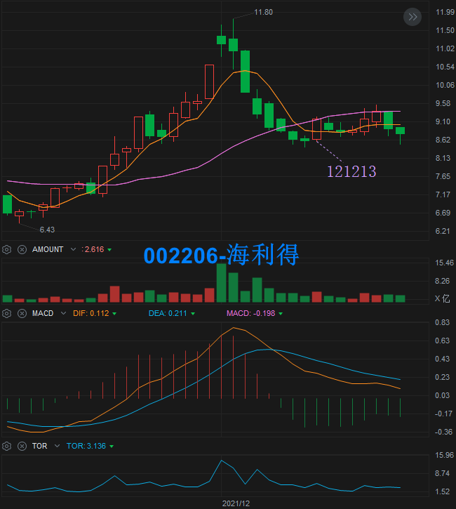

# 大阳后二连阴出小阳-案例

点击 [这里](./大阳后二连阴出小阳.md) 查看选股公式。

案例跟踪：

| 大阳日 |      案例       |   1D    |   2D    |   3D    |   4D    |
|:------:|:----------------|--------:|--------:|--------:|--------:|
| 220106 | 002540-亚太科技 |  +6.35% |  +0.25% |         |         |
| 211231 | 002022-科华生物 |  +4.96% |  +1.38% |  +9.97% |  +1.12% |
| 211228 | 002705-新宝股份 |  +1.62% |  +6.37% |  +0.11% |  +6.85% |
| 211213 | 002206-海利得   |  +3.38% |  +2.18% |  -4.91% |  -1.35% |

> 案例跟踪为通过通达信选股公式选出后，持续跟踪小阳出现后，后续连续4日的涨幅。  
> 1D 为小阳后 1 天的涨幅。

案例回测记录：

|   回测日   | N值 |       案例      |
|:----------:|:---:|:----------------|
| 2022-01-11 |   3 | 002540-亚太科技 |
| 2022-01-11 |   6 | 002022-科华生物 |
| 2022-01-11 |   9 | 002705-新宝股份 |
| 2022-01-11 |  20 | 002206-海利得   |

## 2022-01-06 002540-亚太科技

特点：高位横盘中  
缺点：小阳长上影已突破大阳收盘价

## 2012-12-31 002022-科华生物

特点：到达前期高点附近后迅速回调

## 2012-12-28 002705-新宝股份

特点：到达前期高点附近后迅速回调

## 2012-12-13 002206-海利得

特点：高位回调后的第一次反抽

