# 一阳包三阴-案例

点击 [这里](./一阳包三阴.md) 查看选股公式。

## 案例回测

| 一阳日 |  振幅  |      案例       |   1D    |   2D    |   3D    |
|:------:|-------:|:----------------|--------:|--------:|--------:|
| 22年1月
| 220117 |  9.44% | 600375-汉马科技 |         |         |         |
| 220110 | 16.53% | 300765-新诺威   |  +5.23% |  -0.29% |  -7.28% |
| 220106 | 17.39% | 300572-安车检测 | +19.99% |  +6.94% |  -0.57% |
| 220106 |  9.96% | 000839-中信国安 |  +0.37% |  -1.09% |  -2.58% |
| 220105 | 12.28% | 002348-高乐股份 | +10.09% |  +3.59% |  -6.15% |
| 21年12月
| 211222 | 13.65  | 300113-顺网科技 |  +0.37% |  -3.03% |  +3.51% |
| 211221 |  9.02  | 600340-华夏幸福 |  +0.55% |  +0.55% |  -1.63% |
| 211221 | 10.27  | 600649-城投控股 |  +0.73% |  -0.24% |  -0.24% |
| 211221 |  9.61  | 000656-金科股份 |  +2.26% |  +0.44% |  -2.42% |
| 211221 | 12.50  | 300135-保利国际 |  +0.36% |  +2.55% |  -0.35% |
| 211221 | 11.92  | 300279-和晶科技 |  +1.50% |  +0.30% |  -1.18% |
| 211221 | 10.46  | 600823-世茂股份 |  +2.15% |  -0.30% |  -1.20% |
| 211221 | 19.96  | 300935-盈建科   |  +1.04% |  -3.49% |  +0.72% |
| 211220 | 11.45  | 000711-京蓝科技 |  -1.40% |  +0.71% |  -2.46% |
| 211201 | 20.81% | 300301-长方集团 |  -2.43% |  +1.93% |  +2.44% | MACD死叉

> 案例跟踪为通过通达信选股公式选出后，持续跟踪三阴出现后，后续连续 3 日的涨幅。  
> 1D 为三阴后 1 天的涨幅。

## 案例截图

### 2022-01-17 600375-汉马科技

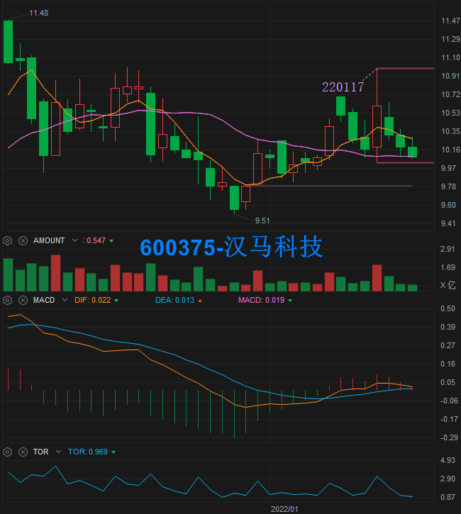

### 2022-01-10 300765-新诺威

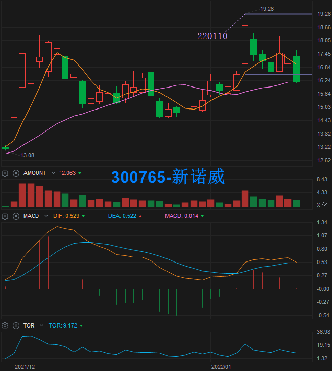

### 2022-01-06 300572-安车检测

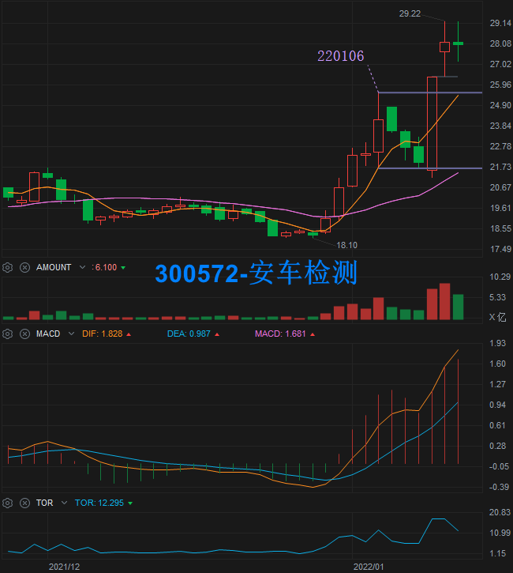

### 2022-01-06 000839-中信国安

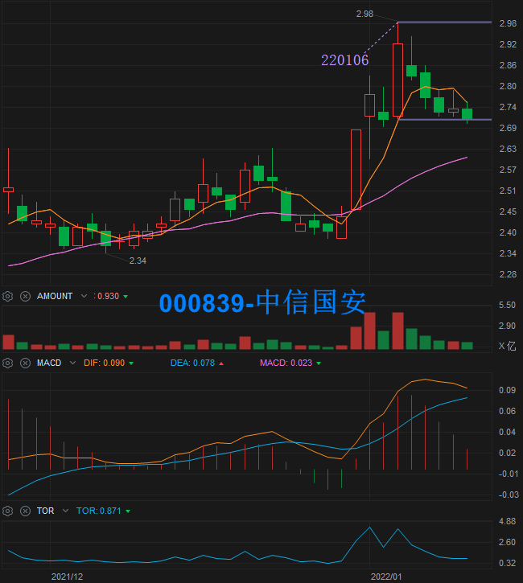

### 2022-01-05 002348-高乐股份

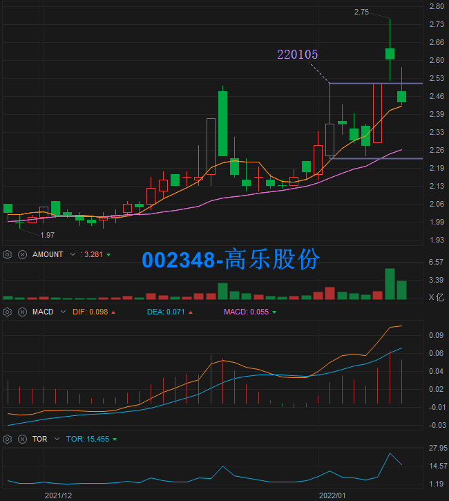

### 2021-12-22 300113-顺网科技

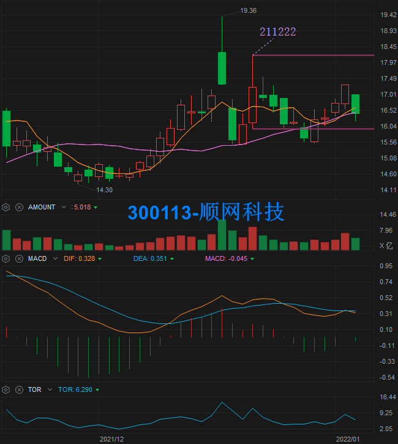

### 2021-12-21 600340-华夏幸福

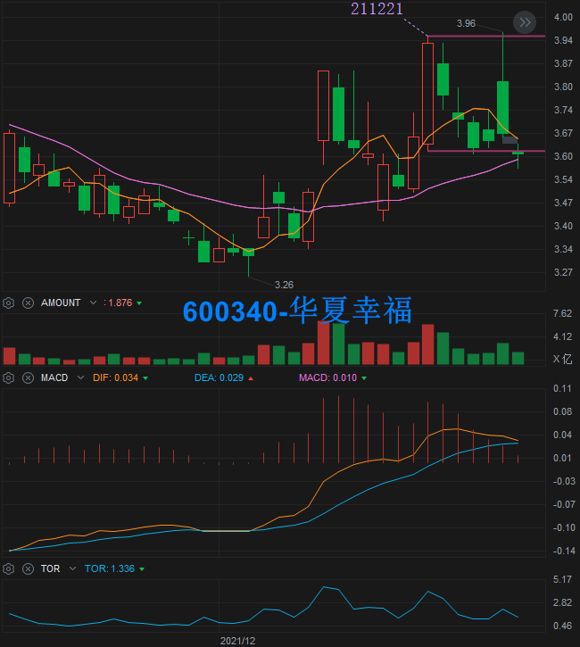

### 2021-12-21 600649-城投控股

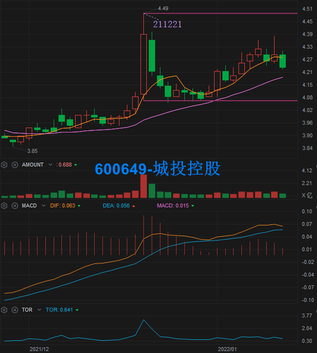

### 2021-12-21 000656-金科股份

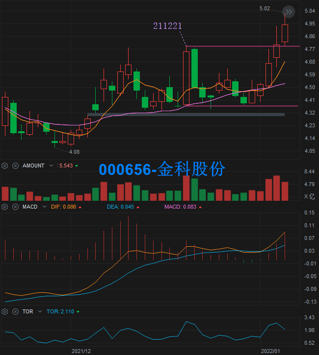

### 2021-12-21 300135-保利国际

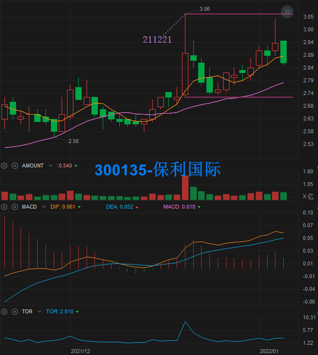

### 2021-12-21 300279-和晶科技

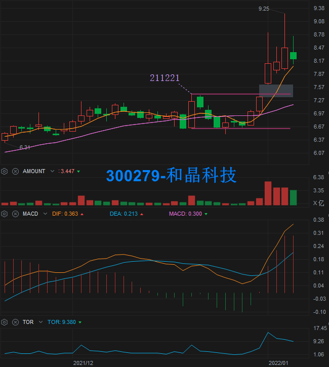

### 2021-12-21 600823-世茂股份

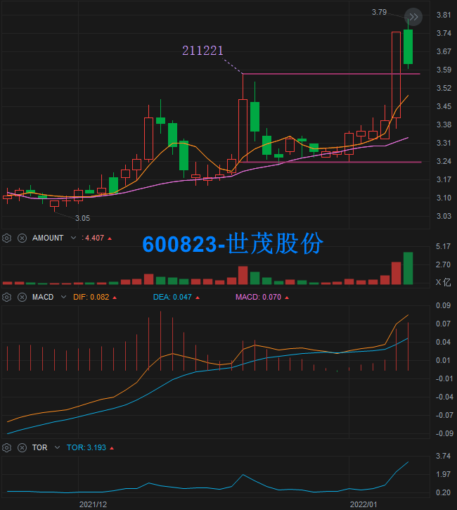

### 2021-12-21 300935-盈建科

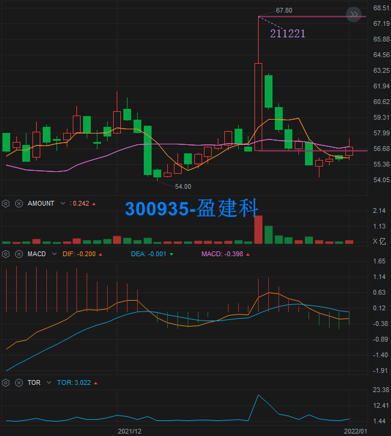

### 2021-12-20 000711-京蓝科技

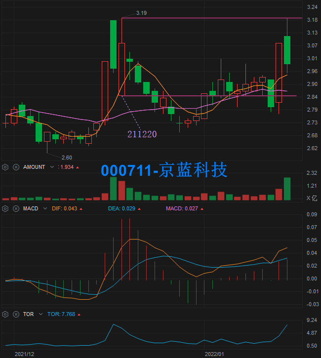

### 2021-12-01 300301-长方集团

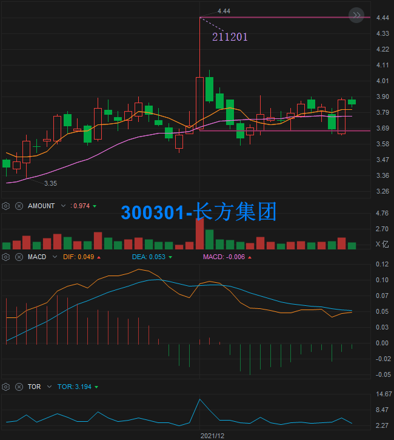
