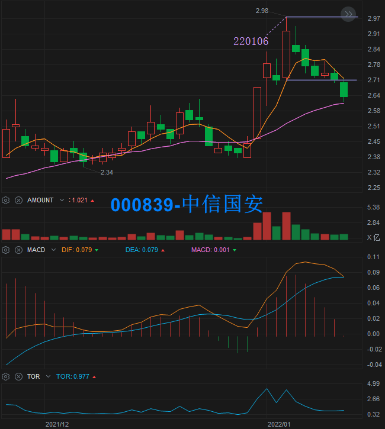

# 一阳包三阴-案例

点击 [这里](./一阳包三阴.md) 查看选股公式。

## 案例回测

| 一阳日 |  振幅  |      案例       |   1D    |   2D    |   3D    |
|:------:|-------:|:----------------|--------:|--------:|--------:|
| 22年1月
| 220105 | 12.28% | 002348-高乐股份 | +10.09% |  +3.59% |  -6.15% |
| 220106 | 17.39% | 300572-安车检测 | +19.99% |  +6.94% |  -0.57% |
| 220106 |  9.96% | 000839-中信国安 |  +0.37% |  -1.09% |  -2.58% |

> 案例跟踪为通过通达信选股公式选出后，持续跟踪三阴出现后，后续连续 3 日的涨幅。  
> 1D 为三阴后 1 天的涨幅。

## 案例截图

### 2022-01-05 002348-高乐股份

### 2022-01-06 300572-安车检测

### 2022-01-06 000839-中信国安

