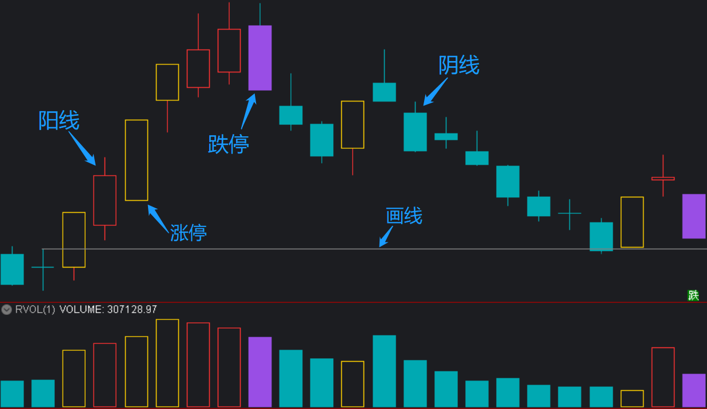

[返回](README.md)

# RJ 的通达信软件配色方案

|  类别  |      RGB        | RGBXRRGGBB | COLORBBGGRR | 简述 |
|:------:|-----------------|------------|-------------|:----:|
| 背景色 | RGB(28,29,33)   | RGBX1C1D21 | COLOR211D1C  |  黑  |
|  阴线  | RGB(0,169,178)  | RGBX00A9B2 | COLORB2A900  |  绿  |
|  阳线  | RGB(255,61,61)  | RGBXFF3D3D | COLOR3D3DFF  |  红  |
|  涨停  | RGB(255,208,0)  | RGBXFFD000 | COLOR00D0FF  |  黄  |
|  跌停  | RGB(153,78,229) | RGBX994EE5 | COLORE54E99  |  蓝  |
|  画线  | RGB(0,128,128)  | RGBX008080 | COLOR808000  | 浅灰 |

> 使用仿同花顺远航版的配色方案。  
> Since 2022-10-01 <rongjih@163.com>。