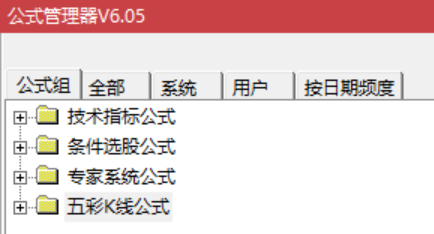
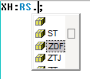

[返回](README.md)

# RJ 的通达信公式编写规范

目录：

```
1. 通达信公式的内部规则限制
2. 公式分类规则
3. 公式命名规则
4. 软件配色方案
```

## 1. 通达信公式的内部规则限制

1. 通达信的4大类公式组之间的命名是互相独立的，每类公式内部的名称不允许相同，但不同公式组之间可以同名。  
    
2. 通过名称引用公式时，默认是引用 “技术指标公式”，引用 “条件选股公式” 需要添加前缀 “EXPLORER.”，引用 “专家系统公式”需要添加前缀 “SYSTEM.”。引用格式语法为 `"[$formulaType.]$formulaName.$indicatorName"(参数1,参数2,...)`，如：
    1. 引用“技术指标公式”格式为 `"公式名称.指标名称"(参数)`。
    2. 引用“条件选股公式”格式为 `"EXPLORER.公式名称"(参数)` - 条件选股只有一个输出，即只有一个指标，故可省略指标名称。
    3. 引用“专家系统公式”格式为 `"SYSTEM.公式名称.交易类型"(参数)`，交易类型包括 `ENTERLONG`、`EXITLONG`、`ENTERSHORT`、`EXITSHORT`。
3. 专家系统公式下是不支持建立子类型的，而技术指标公式和条件选股公式下可以建立一级子类型进行分类。
4. \[BUG\] 当编写好一个公式 A 准备在另一个公式 B 引用时，经常会碰到公式 B 测试失败无法引用成功，提示引用的公式 A 没有编译成功之类的错误，此时只需关闭通达信然后重新打开即可。
5. 引用公式可以不添加引号引住，也可以添加。引用编译成功的公式，当键盘输入完公式名称然后输入 `.` 符号时，通达信会自动弹出下拉框辅助你选择该公式可以引用的指标名称。  
    

## 2. 公式分类规则

技术指标公式创建如下 3 个子类型：

1. RJ主图
2. RJ副图
3. RJ测试

条件选股公式创建如下 2 个子类型：

1. RJ选股
2. RJ测试

## 3. 公式命名规则

公式命名统一语法为 `R[T,S]Name`：

1. 公式名称统一添加前缀 `R`，标识为我的个人指标。
2. 如果是中途试验用的公式，统一前缀为 `RT`，`T` 为 Test 的首字母。
3. 对于公共引用类的公式，即仅供其它公式引用的公式，统一前缀为 `RS`，`S` 为 Share 的首字母。
    - 如全局通用指标，公式命名为 `RS`。
    - 如涨跌幅和涨跌停通用指标，公式命名为 `RSZDT`。
4. 名称 `Name` 统一使用字母、数字命名，不使用中文，通常使用中文拼音、英文单词的首字母或该名称特有的简写标记符。如涨跌停使用 `ZDT`（拼音首字母），顾比倒数使用 `CBL`（原名 Count Back Line，单词首字母简写为 CBL）。


> Since 2022-10-01 <rongjih@163.com>。
