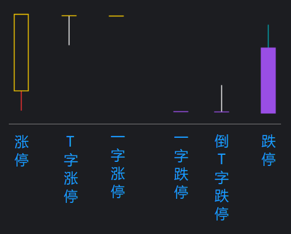

[返回](README.md)

# RZDT-涨跌停 K 线特殊显示

ZDT 为涨跌停的拼音首字母。

## 1. 设计效果



## 2. 个股案例


> 上图为配合公式《[RVOL-成交量柱涨跌停特殊显示]》一起使用的效果，图中为 002750-龙津药业 2022 年 1 月的日 K 图。

[RVOL-成交量柱涨跌停特殊显示]: 13-RVOL-成交量柱涨跌停特殊显示.md

## 3. 主图公式

```tdx
{参数}
SWITCH:=(0,1,1); {Param#0}

{涨停}
ZT:=RS.ZT;
STICKLINE(SWITCH=1 AND ZT,O,C,2.9,1),RGBXFFD000;{实体}
{STICKLINE(SWITCH=1 AND ZT AND O>L,L,O,0.01,0),RGBXFFD000;下影线};

{跌停}
DT:=RS.DT;
STICKLINE(SWITCH=1 AND DT,O,C,2.9,0),RGBX994EE5;{实体}
{STICKLINE(SWITCH=1 AND DT AND O<H,O,H,0.01,0),RGBX994EE5;上影线};
```

备注：

1. 此公式依赖于公式《[RS-常规指标集](11-RS-常规指标集.md)》。
2. 因通达信没有绘制与 K 线下影线等长等粗的方法，故涨跌停暂时只用特殊颜色重绘 K 线实体部分，影线部分保持原来 K 线的颜色不变。（上述注释掉的影线重绘代码虽然用了 0.01 的细线，但实际显示效果还是很粗的线）
3. 因通达信没有函数可以确定个股的 ST 转折点，因此带 ST 转折的个股，如果存在涨跌幅限制的变动，特别是主板（10% 转 ST 后是 5%），在历史回显中可能存在错误的涨跌停判断。2020 年 9 月 13 日之后的创业板 ST，因涨跌幅均为 20% 不变而不受影响。科创板（20% ）、北交所 A 股（30% ）也是不区分 ST 保持涨跌幅不变而不受影响。

**参数精灵：**

```txt
涨跌停特色Param#0
(0不启用、1启用，默认1)
```

**用法注释：**

```txt
涨跌停 K 线用特殊颜色重绘
Since 2022-10-01 @RJ <rongjih@163.com>
```

## 4. 下载

[RZDT-涨跌停K线特殊显示-v221005.tn6](assets/12-RZDT-涨跌停K线特殊显示-v221005.tn6)
