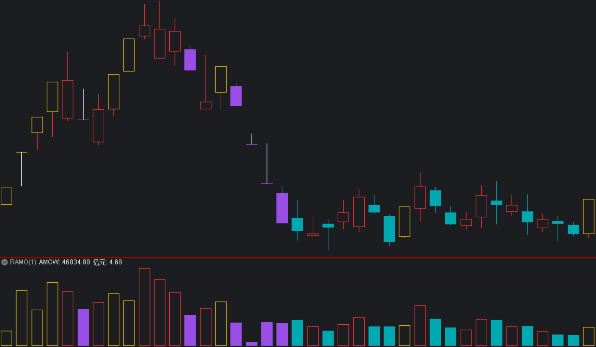

[返回](README.md)

# RAMO-成交额柱涨跌停特殊显示

AMO 为成交额的简写，一般的成交额副图公式名称就是 AMO，带均线显示，本公式删除了均线，然后对应涨跌停的额柱用特殊颜色显示。

## 1. 设计效果



> 上图为配合公式《[RZDT-涨跌停 K 线特殊显示]》一起使用的效果，图中为 002750-龙津药业 2022 年 1 月的日 K 图。

[RZDT-涨跌停 K 线特殊显示]: 12-RZDT-涨跌停K线特殊显示.md

## 2. 幅图公式

画线方法：副图

```tdx
{参数}
SWITCH:=(0,1,1); {Param#0}

{默认的成交额柱}
AMOW:AMOUNT/10000.00,VOLSTICK;

{涨停}
STICKLINE(SWITCH=1 AND RS.ZT,0,AMOW,2.9,1),RGBXFFD000;
{跌停}
STICKLINE(SWITCH=1 AND RS.DT,0,AMOW,2.9,0),RGBX994EE5;

亿元:AMOUNT/100000000.00,NODRAW;
```

备注：

1. 此公式依赖于公式《[RS-常规指标集](11-RS-常规指标集.md)》。
2. 因通达信没有函数可以确定个股的 ST 转折点，因此带 ST 转折的个股，如果存在涨跌幅限制的变动，特别是主板（10% 转 ST 后是 5%），在历史回显中可能存在错误的涨跌停判断。2020 年 9 月 13 日之后的创业板 ST，因涨跌幅均为 20% 不变而不受影响。科创板（20% ）、北交所 A 股（30% ）也是不区分 ST 保持涨跌幅不变而不受影响。

**参数精灵：**

```txt
涨跌停特色Param#0
(0不启用、1启用，默认1)
```

**用法注释：**

```txt
成交额柱涨跌停特殊颜色显示
Since 2022-10-01 @RJ <rongjih@163.com>
```

## 3. 下载

[RAMO-成交额柱涨跌停特殊显示-v221005.tn6](assets/14-RAMO-成交额柱涨跌停特殊显示-v221005.tn6)
