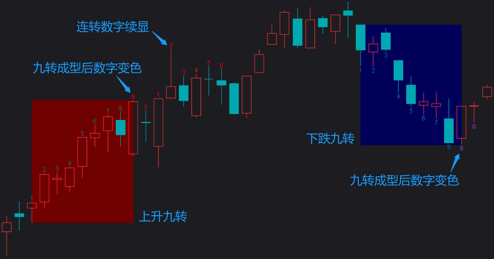
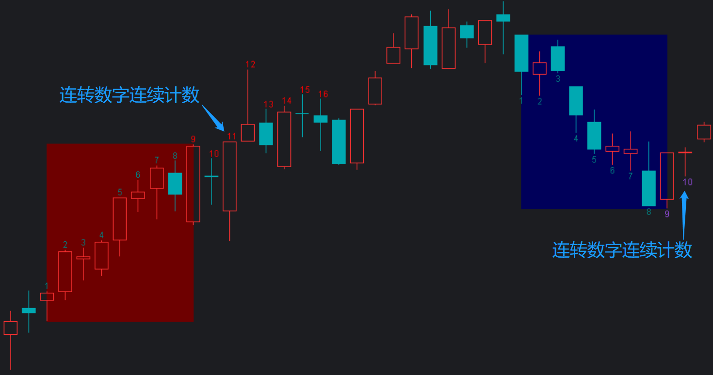
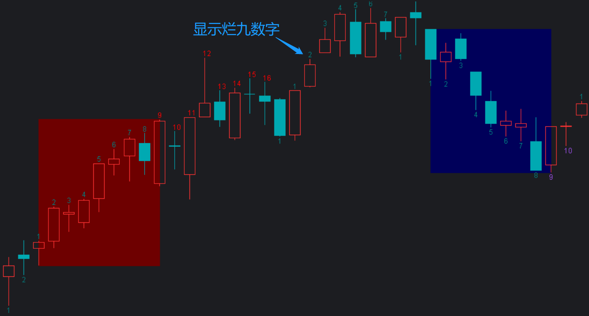
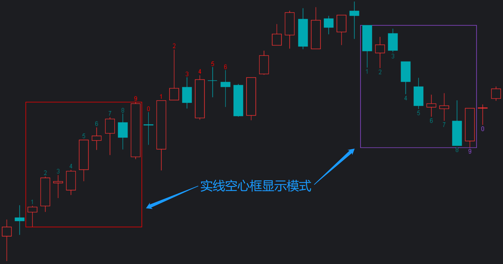
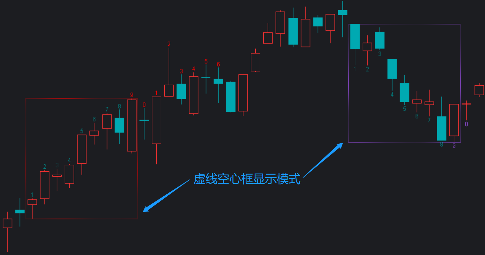
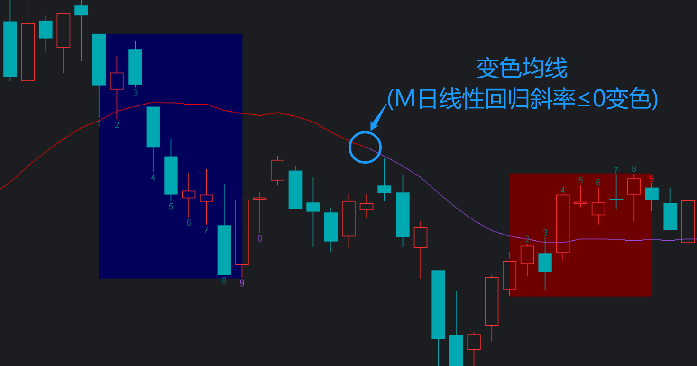
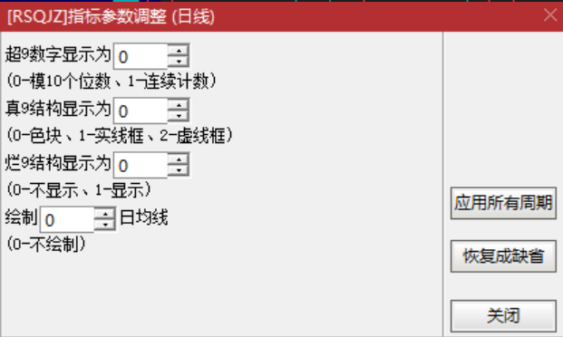
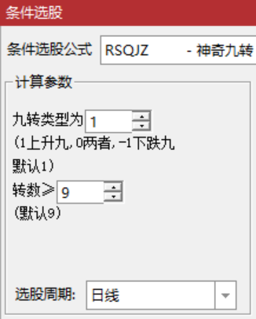

[返回](README.md)

# RSQJZ-神奇九转

## 1. 基本原理

1. 上升九转：连续 9 次收盘价高于前面第 4 根 K 线的收盘价
2. 下跌九转：连续 9 次收盘价低于前面第 4 根 K 线的收盘价

## 2. 设计效果

**颜色：**（兼容《[软件配色方案](01-软件配色方案.md)》）

|  类别             |      RGB        | RGBXRRGGBB | COLORBBGGRR | 简述          |
|:-----------------:|-----------------|------------|-------------|:-------------:|
| 上升九转数字 1～8 | RGB(0,128,128)  | RGBX008080 | COLOR808000 |  浅灰         |
| 上升九转数字 9～  | RGB(255,0,0)    | RGBXFF0000 | COLOR0000FF |  红           |
| 上升九转矩形边框  | RGB(255,0,0)    | RGBXFF0000 | COLOR0000FF |  红           |
| 上升九转色块      | RGB(110,0,0)    | RGBX6E0000 | COLOR00006E |  浅红         |
| 下跌九转数字 1～8 | RGB(0,128,128)  | RGBX008080 | COLOR808000 |  浅灰         |
| 下跌九转数字 9～  | RGB(153,78,229) | RGBX994EE5 | COLORE54E99 |  蓝           |
| 下跌九转矩形边框  | RGB(153,78,229) | RGBX994EE5 | COLORE54E99 |  蓝           |
| 下跌九转色块      | RGB(0,0,90 )    | RGBX00005A | COLOR5A0000 |  浅蓝         |
| 均线(斜率向上)    | RGB(255,0,0)    | RGBXFF0000 | COLOR0000FF |  红           |
| 均线(斜率向下)    | RGB(153,78,229) | RGBX994EE5 | COLORE54E99 |  蓝           |

**效果：**

色块显示模式：（连转数字显示为模 10 的个位数，此为默认模式）



色块显示模式：（连转数字显示为连续计数）



色块显示模式：（显示烂九数字）



实线空心框显示模式：



虚线空心框显示模式：



带变色均线显示模式：



> 图示是 000001-上证指数 2022 年 5～7 月的日 K 图。

## 3. 主图公式

画线方法：主图叠加

```tdx
{参数}
NT:=(0,1,0);  {Param#0}
ST:=(0,2,0);  {Param#1}
FT:=(0,1,0);  {Param#2}
M:=(0,250,0); {Param#3}

{1.上升九转}
UP_BASE:=IF(C>REF(C,4),1,0); {基本条件:收盘价大于前面第4跟K线收盘价}
UP_N1:=UP_BASE AND NOT(REF(UP_BASE,1)); {1的条件}
UP_N1_P:=BARSLAST(UP_N1)+1;             {1的位置+1}
UP_COUNT:=COUNT(UP_BASE,UP_N1_P);       {转数}
UP_N:=UP_COUNT=UP_N1_P;                 {>=1的条件}
UP_N_BREAK:=UP_N AND NOT(REFX(UP_N AND UP_COUNT=9,9-UP_COUNT)); {烂九}
{ST>0时九转高低点绘制空心矩形}
STICKLINE(
  ST>0 AND UP_N AND UP_COUNT=5 AND REFX(UP_N AND UP_COUNT=9,4),
  REFX(LLV(L,9),4),REFX(HHV(H,9),4),9*4+1.5,IF(ST=1,1,-1)
),RGBXFF0000;
{ST=0时九转结构显示为色块}
UP_9N:=UP_N AND REFX(UP_N AND UP_COUNT=9,9-UP_COUNT);
UP_9N_P:=BARSLAST(UP_9N);
{--色块高点}
UP_9H:=IF(ST=0 AND UP_9N,REFX(HHV(H,9),9-UP_COUNT),DRAWNULL);
{--色块低点}
UP_9L:=IF(ST=0 AND UP_9N,REFX(LLV(L,9),9-UP_COUNT),DRAWNULL);
DRAWBAND(UP_9H,RGB(110,0,0),UP_9L,DRAWNULL);
{K线高点绘制九转数字:1~8常规色、>=9特殊色}
UP_SHOW_BREAK:=IF(FT=0,NOT(UP_N_BREAK),1);
DRAWNUMBER(UP_N AND UP_COUNT<9 AND UP_SHOW_BREAK,H,UP_COUNT),DRAWABOVE,RGBX008080;
DRAWNUMBER(UP_N AND UP_COUNT>=9,H,IF(NT=0,MOD(UP_COUNT,10),UP_COUNT)),DRAWABOVE,RGBXFF0000;

{2.下跌九转}
DOWN_BASE:=IF(C<REF(C,4),1,0); {基本条件:收盘价小于前面第4跟K线收盘价}
DOWN_N1:=DOWN_BASE AND NOT(REF(DOWN_BASE,1)); {1的条件}
DOWN_N1_P:=BARSLAST(DOWN_N1)+1;               {1的位置+1}
DOWN_COUNT:=COUNT(DOWN_BASE,DOWN_N1_P);       {转数}
DOWN_N:=DOWN_COUNT=DOWN_N1_P;                 {>=1的条件}
DOWN_N_BREAK:=DOWN_N AND NOT(REFX(DOWN_N AND DOWN_COUNT=9,9-DOWN_COUNT)); {烂九}
{ST>0时九转高低点绘制空心矩形}
STICKLINE(
   ST>0 AND DOWN_N AND DOWN_COUNT=5 AND REFX(DOWN_N AND DOWN_COUNT=9,4),
  REFX(LLV(L,9),4),REFX(HHV(H,9),4),9*4+1.5,IF(ST=1,1,-1)
),RGBX994EE5;
{ST=0时九转结构显示为色块}
DOWN_9N:=DOWN_N AND REFX(DOWN_N AND DOWN_COUNT=9,9-DOWN_COUNT);
DOWN_9N_P:=BARSLAST(DOWN_9N);
{--色块高点}
DOWN_9H:=IF(ST=0 AND DOWN_9N,REFX(HHV(H,9),9-DOWN_COUNT),DRAWNULL);
{--色块低点}
DOWN_9L:=IF(ST=0 AND DOWN_9N,REFX(LLV(L,9),9-DOWN_COUNT),DRAWNULL);
DRAWBAND(DOWN_9H,RGB(0,0,90),DOWN_9L,DRAWNULL);
{低点绘制九转数字:1~8常规色、>9特殊色}
DOWN_SHOW_BREAK:=IF(FT=0,NOT(DOWN_N_BREAK),1);
DRAWNUMBER(DOWN_N AND DOWN_COUNT<9 AND DOWN_SHOW_BREAK,L,DOWN_COUNT),RGBX008080;
DRAWNUMBER(DOWN_N AND DOWN_COUNT>=9,L,IF(NT=0,MOD(DOWN_COUNT,10),DOWN_COUNT)),RGBX994EE5;

{3. 重绘九转K线-因色块和矩形都不透明盖住了}
DRAWKLINE(IF(UP_9N OR DOWN_9N,HIGH,DRAWNULL),OPEN,LOW,CLOSE);

{4. 绘制变色均线}
MA0:=MA(C,M); {M日均线}
MAUP:=SLOPE(MA0,M)>0; {M日均线线型回归斜率是否向上}
L1:IF(M>0,MA0,DRAWNULL),RGBX994EE5; {斜率向下色}
L2:IF(M>0 AND MAUP,MA0,DRAWNULL),RGBXFF0000; {斜率向上色}
```

**参数精灵：**

```txt
超9数字显示为Param#0
(0-模10个位数、1-连续计数)
真9结构显示为Param#1
(0-色块、1-实线框、2-虚线框)
烂9结构显示为Param#2
(0-不显示、1-显示)
绘制Param#3日均线
(0-不绘制)
```



**用法注释：**

```txt
神奇九转
1. 上升九转：连续 9 次收盘价高于前面第 4 根K线的收盘价。
2. 下跌九转：连续 9 次收盘价低于前面第 4 根K线的收盘价。

注：
1. 本指标在主图显示所有九转的转变数字历史。
2. 成功的九转会在九转结构高低点绘制色块或矩形，上升九转下跌九转用不同颜色区分。
3. 九转之后如果继续转，本指标会继续显示 10、11、...（或 0、1、...）等数字，直到逻辑中断为止。

上升九转卖点参考：
1. 8 或 9 的最高价大于 6 或 7 的最高价。
2. 突破九转结构高点折返(突破折返)。

下跌九转买点参考：
1. 8 或 9 的最低价小于 6 或 7的最低价。
2. 跌破九转结构低点返回(回踩不破)。

Since 2022-10-05 @RJ <rongjih@163.com>
```

## 4. 选股公式

```tdx
UP:=BARSLASTCOUNT(C>REF(C,4))>=N;
DOWN:=BARSLASTCOUNT(C<REF(C,4))>=N;
XH:IF(T=-1,DOWN,IF(T=1,UP,UP OR DOWN));
```

**参数精灵：**

```txt
九转类型为Param#0
(1上升九,0两者,-1下跌九
默认1)
转数≥Param#1
(默认9)
```



**用法注释：**

```txt
选择已出现上升九转或下跌九转结构的个股。
Since 2022-10-06 @RJ <rongjih@163.com>
```

## 5. 下载

[RSQJZ-神奇九转-v221005.tn6](assets/15-RSQJZ-神奇九转-v221005.tn6)
