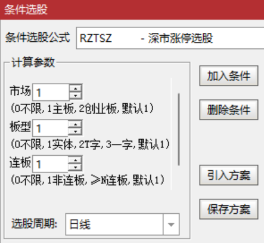

[返回](README.md)

# RZTSZ-深市涨停选股

ZT 为涨停拼音首字母、SZ 为深圳拼音首字母。

便捷选择深市各种类型的涨停股票：

1. 主板、创业板。
2. 实体板、T字板、一字板。
3. 首板、连板。

## 1. 选股公式

```tdx
{参数}
MK:=(0,2,1);
BX:=(0,3,1);
LB:=(0,20,1);

ST:=NAMEINCLUDE('ST');{ST股}
SZ:=SETCODE=0; {深市}
SZZB:=SZ AND FINANCE(3)=1;{主板}
SZCYB:=FINANCE(3)=3;{创业板}
{涨跌幅}
ZDF:=IF(
  {5%: 主板ST或<2020-09-13的创业板ST}
  (SZZB AND ST) OR (SZCYB AND ST AND DATE<1200913),0.05,
  {10%: 主板或<2020-08-24的创业板}
  IF(SZZB OR (SZCYB AND DATE<1200824),0.1,
  {其余20%}
  0.2));
ZTJ:=IF(PERIOD=5,ZTPRICE(REF(C,1),ZDF),DRAWNULL);{涨停价}
ZT:=C>=ZTJ AND C=H;{涨停}
{选股信号}
XH:IF(MK=0,SZ,IF(MK=1,SZZB,IF(MK=2,SZCYB,0))) {深市}
  AND ZT {涨停}
  {板型}
  AND IF(BX=1{实体},C>O,IF(BX=2{T字},C=O AND C>L,IF(BX=3{一字},C=O AND C=L,1)))
  {连板}
  AND IF(LB=0{不限},1,IF(LB=1{非连板},NOT(REF(ZT,1)),{≥N连板}BARSLASTCOUNT(ZT)>=LB));
```

> 因选股涉及股票数量多，基于性能考虑没有依赖《[RS-常规指标集]》中的涨跌停指标。

**参数精灵：**

```txt
市场Param#0
(0不限,1主板,2创业板,默认1)
板型Param#1
(0不限,1实体,2T字,3一字,默认1)
连板Param#2
(0不限,1非连板,≥N连板,默认1)
```



**用法注释：**

```txt
深市涨停选股：
1. 主板、创业板。
2. 实体板、T字板、一字板。
3. 首板、连板。
Since 2022-10-06 @RJ <rongjih@163.com>
```

## 2. 下载

[RZTSZ-深市涨停选股-v221006.tn6](assets/16-RZTSZ-深市涨停选股-v221006.tn6)


[RS-常规指标集]: 11-RS-常规指标集.md
