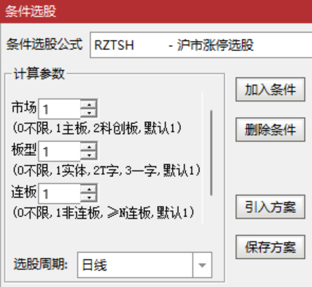

[返回](README.md)

# RZTSH-沪市涨停选股

ZT 为涨停拼音首字母、SH 为上海拼音首字母。

便捷选择沪市各种类型的涨停股票：

1. 主板、创业板。
2. 实体板、T字板、一字板。
3. 首板、连板。

## 1. 选股公式

```tdx
{参数}
MK:=(0,2,1);
BX:=(0,3,1);
LB:=(0,20,1);

ST:=NAMEINCLUDE('ST');{ST股}
SH:=SETCODE=1; {沪市}
SHZB:=SH AND FINANCE(3)=1;{主板}
SHKCB:=FINANCE(3)=4;{科创板}
{涨跌幅:ST5%、主板10%、科创板20%}
ZDF:=IF(SHZB,IF(ST,0.05,0.1),0.2);
ZTJ:=IF(PERIOD=5,ZTPRICE(REF(C,1),ZDF),DRAWNULL);{涨停价}
ZT:=C>=ZTJ AND C=H;{涨停}
{选股信号}
XH:IF(MK=0,SH,IF(MK=1,SHZB,IF(MK=2,SHKCB,0))) {沪市}
  AND ZT {涨停}
  {板型}
  AND IF(BX=1{实体},C>O,IF(BX=2{T字},C=O AND C>L,IF(BX=3{一字},C=O AND C=L,1)))
  {连板}
  AND IF(LB=0{不限},1,IF(LB=1{非连板},NOT(REF(ZT,1)),{≥N连板}BARSLASTCOUNT(ZT)>=LB));
```

> 因选股涉及股票数量多，基于性能考虑没有依赖《[RS-常规指标集]》中的涨跌停指标。

**参数精灵：**

```txt
市场Param#0
(0不限,1主板,2科创板,默认1)
板型Param#1
(0不限,1实体,2T字,3一字,默认1)
连板Param#2
(0不限,1非连板,≥N连板,默认1)
```



**用法注释：**

```txt
沪市涨停选股：
1. 主板、科创板。
2. 实体板、T字板、一字板。
3. 首板、连板。
Since 2022-10-06 @RJ <rongjih@163.com>
```

## 2. 下载

[RZTSH-沪市涨停选股-v221006.tn6](assets/17-RZTSH-沪市涨停选股-v221006.tn6)


[RS-常规指标集]: 11-RS-常规指标集.md
