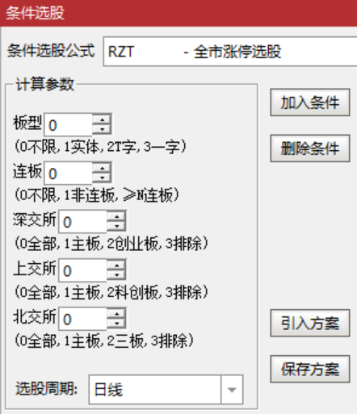

[返回](README.md)

# RZT-全市涨停选股

ZT 为涨停拼音首字母。

便捷选择全市各种类型的涨停股票：

1. 实体板、T字板、一字板。
2. 首板、连板。
3. 深交所主板（00开头）、创业板（30开头）。
4. 上交所主板（60开头）、科创板（68开头）。
5. 北交所主板（8开头）、三板（4开头）。

## 1. 选股公式

```tdx
{参数}
BX:=(0,3,0);
LB:=(0,20,0);
TSZ:=(0,3,0);
TSH:=(0,3,0);
TBJ:=(0,3,0);

{====市场判别}
{ST股}
ST:=NAMEINCLUDE('ST');
{沪深两市}
HS:=SETCODE=0 OR SETCODE=1;
HSZB:=FINANCE(3)=1;{主板}
HSZBST:=HSZB AND ST;
{深交所}
SZ:=SETCODE=0;
SZST:=SZ AND ST;
SZZB:=SZ AND FINANCE(3)=1;{主板}
SZZBST:=SZZB AND ST;
SZCYB:=FINANCE(3)=3;{创业板}
SZCYBST:=SZCYB AND ST;
{上交所}
SH:=SETCODE=1;
SHST:=SH AND ST;
SHZB:=SH AND FINANCE(3)=1;{主板}
SHZBST:=SHZB AND ST;
SHKCB:=FINANCE(3)=4;{科创板}
SHKCBST:=SHKCB AND ST;
{北交所}
BJ:=SETCODE=2;
BJZB:=CODELIKE('8');{主板}
BJSB:=CODELIKE('4');{三板}

{====涨停判别}
{涨跌幅}
ZDF:=IF(
  {5%: 沪深主板ST或<2020-09-13的创业板ST}
  HSZBST OR (SZCYBST AND DATE<1200913), 0.05,
  {10%: 沪深主板或<2020-08-24的创业板}
  IF(HSZB OR (SZCYB AND DATE<1200824),  0.1,
  {20%: 科创板或>=2020-08-24的创业板}
  IF(SHKCB OR (SZCYB AND DATE>=1200824),0.2,
  {30%: 北交所}
  IF(BJZB OR BJSB,                      0.3,
  {其它情况返回无效值}
  DRAWNULL)))
);
{涨停价-仅日线适用}
ZTJ:=IF(PERIOD=5,ZTPRICE(REF(C,1),ZDF),DRAWNULL);
{涨停}
ZT:=C>=ZTJ AND C=H;

{====选股信号}
XH:
  {市场}
  (
       IF(TSZ=0,SZ,IF(TSZ=1,SZZB,IF(TSZ=2,SZCYB,0))) {深交所}
    OR IF(TSH=0,SH,IF(TSH=1,SHZB,IF(TSH=2,SHKCB,0))) {上交所}
    OR IF(TBJ=0,BJ,IF(TBJ=1,BJZB,IF(TBJ=2,BJSB, 0))) {北交所}
  )
  {涨停}
  AND ZT
  {板型}
  AND IF(BX=1{实体},C>O,IF(BX=2{T字},C=O AND C>L,IF(BX=3{一字},C=O AND C=L,1)))
  {连板}
  AND IF(LB=0{不限},1,IF(LB=1{非连板},NOT(REF(ZT,1)),{≥N连板}BARSLASTCOUNT(ZT)>=LB));
```

> 因选股涉及股票数量多，基于性能考虑没有依赖《[RS-常规指标集]》中的涨跌停指标。

**参数精灵：**

```txt
板型Param#0
(0不限,1实体,2T字,3一字)
连板Param#1
(0不限,1非连板,≥N连板)
深交所Param#2
(0全部,1主板,2创业板,3排除)
上交所Param#3
(0全部,1主板,2科创板,3排除)
北交所Param#4
(0全部,1主板,2三板,3排除)
```



**用法注释：**

```txt
便捷选择全市各种类型的涨停股票：
1. 实体板、T字板、一字板。
2. 首板、连板。
3. 深交所主板（00开头）、创业板（30开头）。
4. 上交所主板（60开头）、科创板（68开头）。
5. 北交所主板（8开头）、三板（4开头）。
Since 2022-10-07 @RJ <rongjih@163.com>
```

## 2. 下载

[RZT-全市涨停选股-v221007.tn6](assets/RZT-全市涨停选股-v221007.tn6)


[RS-常规指标集]: 11-RS-常规指标集.md
